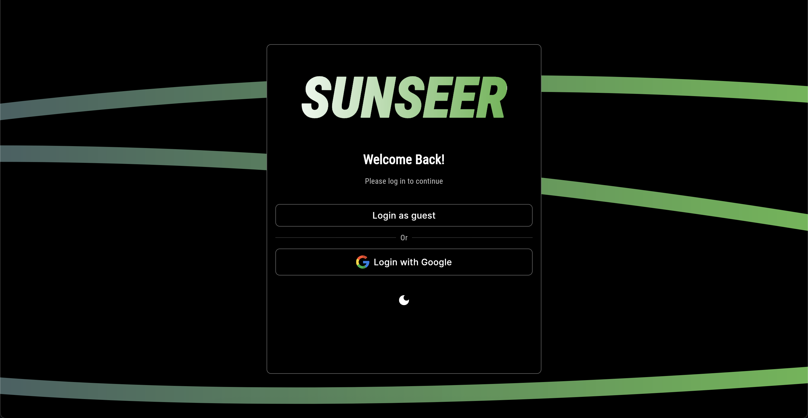
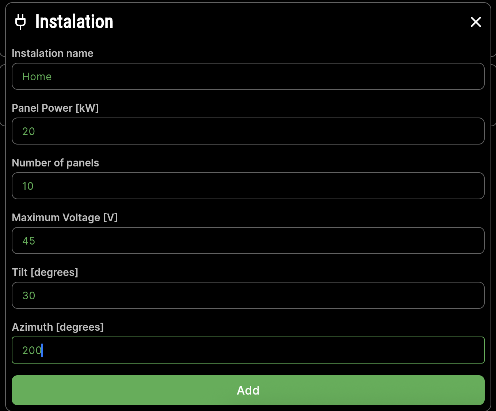
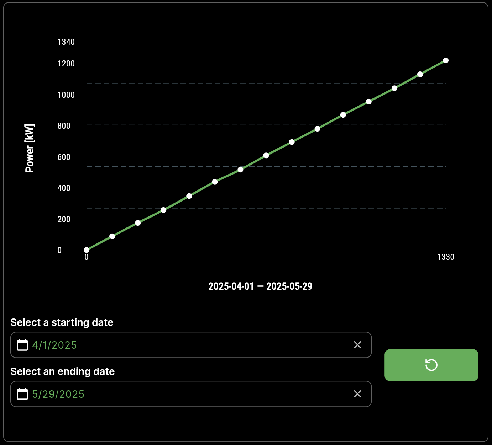
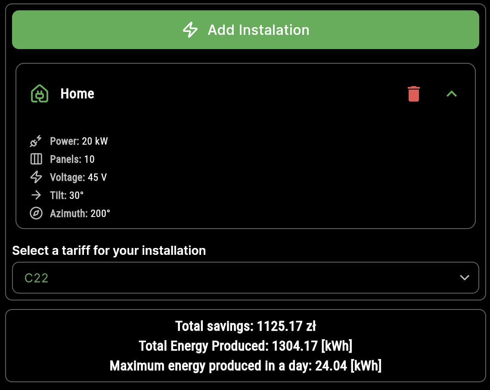
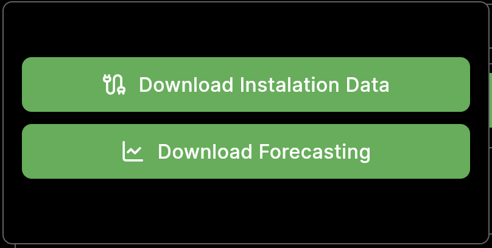

# SUNSEER

**Aplikacja webowa do szybkich analiz i prognoz finansowych dla instalacji elektrycznych**  
SUNSEER pozwala użytkownikom przechowywać informacje o swoich instalacjach w chmurze, pobierać dane historyczne i prognozy, a także generować czytelne raporty finansowe.  

---

## 1. Motywacja

Często potencjalni klienci mają problem ze zdobyciem rzetelnych danych i szacunków finansowych dla swoich instalacji fotowoltaicznych. Proces ten bywa czasochłonny i wymaga znajomości różnych źródeł danych.  
W SUNSEER skupiliśmy się na **prostocie** i **skuteczności** – chcemy, aby każdy użytkownik mógł w kilku krokach uzyskać realne prognozy i zrozumieć, jakie korzyści niesie montaż paneli.

---

## 2. Funkcjonalności

1. **Analiza opłacalności na podstawie lokalizacji**  
   - Po wybraniu lub pobraniu lokalizacji aplikacja oblicza, jak panele fotowoltaiczne sprawdzą się w danym miejscu.
   - Dzięki dokładnym algorytmom uwzględniamy orientację, kąt nachylenia dachu i średnie nasłonecznienie.

2. **Zaawansowane algorytmy szacunkowe**  
   - Używamy otwartego API pogodowego, aby pobierać dane historyczne i prognozy.
   - Model uwzględnia zmiany sezonowe i niuanse klimatyczne, co przekłada się na trafniejsze wyniki.

3. **Wykres potencjalnych oszczędności**  
   - Interaktywny wykres przedstawiający oszczędności w zadanym przedziale czasu (np. 1, 5, 10 lat).
   - Możliwość dostosowania horyzontu czasowego i podglądu sezonowych wahań produkcji energii.

4. **Pobieranie prognoz i danych historycznych**  
   - Eksport danych do pliku CSV, aby móc wykorzystać wyniki w dalszych analizach.
   - Proste przyciski „Pobierz historię” i „Pobierz prognozę” w interfejsie.

5. **Logowanie i autoryzacja przez Google**  
   - Szybki start: użytkownik może zalogować się jednym kliknięciem, używając swojego konta Google.
   - Bezpieczeństwo oparte na Firebase Authentication.

6. **Tryb anonimowy**  
   - Osoby, które nie chcą logować się na konto, mogą skorzystać z aplikacji w trybie anonimowym i zobaczyć szacunkowe dane bez zapisywania historii w chmurze.

---

## 3. Architektura i Technologie

- **Frontend**: Flutter (Web)  
  - Nowocześnie zaprojektowane UI, responsywne na różne rozdzielczości.
  - Łatwe w rozbudowie komponenty i animacje.

- **Backend**: Flutter + Firebase  
  - **Firebase Firestore** – przechowywanie danych użytkowników oraz instalacji
  - **Firebase Authentication** – logowanie przez Google i tryb anonimowy.

- **Dane pogodowe**: Otwarte API 
  - **open-meteo** - korzystamy z otwartego API pogodowe do pobierania szczegółowych danych historycznych dla danej lokazacji z rozdzielczością 9km i zakresem globalnym

---

## 4. Struktura kodu
```bash
/projekt
├── lib
│ ├── animations # Animacje wykorzystywane w aplikacji
│ ├── layout # Główne układy ekranów (layout’y)
│ ├── models # Definicje modeli (pogoda, panele, instalacje)
│ ├── providers # Providerzy do zarządzania stanem (Stateful)
│ ├── repositories # Logika pobierania i parsowania danych pogodowych
│ ├── services # Serwisy: Firebase, API pogodowego, lokalizacji
│ ├── theme # Definicje motywów (kolory, czcionki)
│ ├── widgets # Komponenty UI używane w różnych ekranach
│ └── main.dart # Punkt wejścia – uruchomienie aplikacji
└── README.md # Ta dokumentacja
```

---

## 5. Instalacja i uruchomienie lokalne

> **Uwaga**: Przed rozpoczęciem upewnij się, że masz zainstalowane:
> - Flutter (wersja >= 3.x)  
> - Konto Firebase (ze skonfigurowanym projektem)  
> - Klucz API do firebase

1. **Sklonuj repozytorium**:  
   ```bash
   git clone https://github.com/Jabrocki/piecyk.git
   flutter pub get
   cd lib
   flutter run

---

## 6. Przykładowe demo

Poniżej kilka zrzutów ekranu pokazujących kluczowe funkcje aplikacji:

1. **Ekran logowania**  
   

2. **Ekran główny**  
   

3. **Sekcja do zarządzania instalacjami**  
   

4. **Pobieranie lokalizacji domyślnej/customowej**  
   

5. **Wykres potencjalnie wyprodukowanej energi w zadanym okresie**
   

6. **Potencjalne oszczędności z uwzględnieniem taryfy prądowej**
   

7. **Opcja pobrania danych historycznych/oszczedności**
   

---

## 8. Autorzy / Zespół

- **Franciszek Raźny** – frontend, animacje, UI/UX, pobieranie customowej lokalizacji (geocoding)
- **Jan Jabrocki** – backend, integracje z Firebase, logika serwera  
- **Bartłomiej Pietrzak** – algorytmy szacunkowe, UI,
- **Bartosz Pajor** – pobieranie, parsowanie, przetwarzanie danych pogodowych, pobieranie lokalizacji domyślnej

---

## 9. Licencja

Projekt aktualnie nie posiada oficjalnej licencji. W przyszłości planujemy udostępnić kod na licencji MIT lub innej otwartej licencji, aby społeczność mogła swobodnie rozwijać SUNSEER.  

<sub>Stworzone z myślą o hackatonie – życzymy owocnych ocen i czekamy na Wasze uwagi! 🚀</sub>
